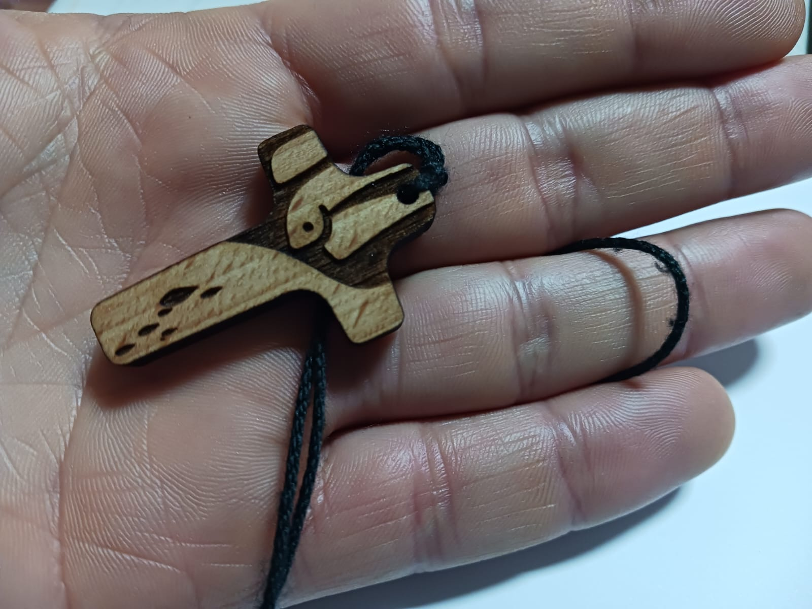

Há muito tempo atrás ouvi uma música (ou antes, um poema musicado) que dizia assim:

*“I carry a cross in my pocket  
A simple reminder to me  
Of the fact that I am a christian  
No matter where I may be."* 

Já não me lembrava deste poema, mas por algum motivo veio-me à cabeça nestes dias e estas palavras ajudaram-me a rezar.
A missa de envio do João foi para mim um momento de muitas emoções à mistura: entre tristeza e alegria, medos e paz. Mas de algum modo foi um momento para o qual olhei numa perspetiva um pouco externa, de espetadora. Só depois, quando conversámos sobre isto, é que comecei a pensar um pouco mais nesta dimensão do envio, do ser enviado. Que existe, de resto, em todas as missas e para todos os que nelas participam e não só neste caso específico. Há um padre natural aqui da Benedita que costuma terminar as celebrações a que preside com “Sois enviados, ide em paz e o Senhor vos acompanhe.” Confesso que nunca prestei muita atenção a esta frase, mas lembrei-me dela quando pensava nestas coisas. Parece-me que tenho participado na missa muito com uma atitude de quem pede, de quem procura (e acho que isso não está mal). Mas pouco, ou talvez quase nada, como quem, tendo recebido, sai porta fora disposto a dar, a viver, com este mandato de de alguma forma ser presença de Jesus nos locais e situações em que vive, no concreto do dia-a-dia. Ou, como termina o poema de que falava:

*“So I carry a cross in my pocket  
Reminding no one but me  
That Jesus Christ is the Lord of my life  
If only I’ll let Him be.”*

{:class="img-nosotros"}

