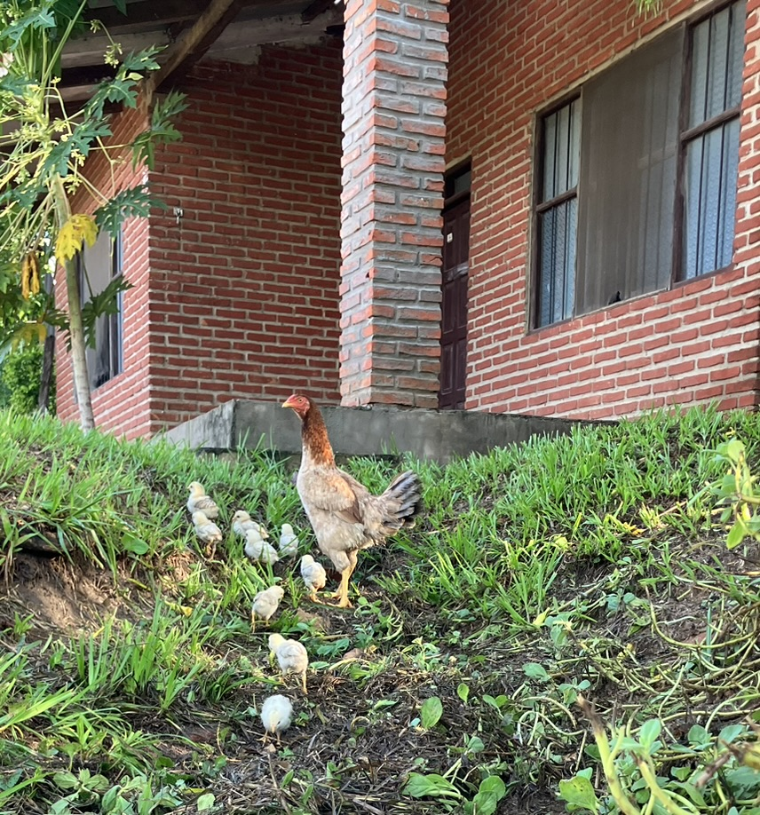

Cuando estoy hablando con James y haciéndole preguntas, ya sea porque no sé hablar español o porque llegué hace pocos días aquí a la misión de Buena Vista, muchas veces termino diciendo: ¡muchas cosas! y luego él me responde con un aire calmo y tranquilo: muchas cosas hermano, muchas cosas...

Llegar a la misión es enfrentarse a muchas cosas. Es entrar en una vida nueva, en una comunidad nueva, en una tierra nueva. En un país nuevo, con un idioma nuevo, con un clima nuevo y con una fauna y flora nuevas. Entonces lo primero que debo hacer es desarmarme y preguntarme: ¿quién soy yo y quien es Dios?

*"¿Qué es el hombre, para que tengas de él memoria,  
Y el hijo del hombre, para que lo visites?" (Salmo 8:4)* 

{:class="img-nosotros"}

