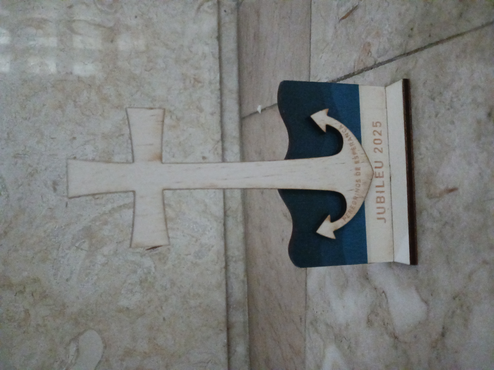

Tenho percebido, de há algum tempo para cá, que Deus me chama insistentemente à confiança. O que para mim é difícil e pouco natural, talvez por ainda a confundir muito com passividade. Ou, mais provavelmente, por na maior parte do tempo querer fazer tudo sozinha e pelas minhas forças. Mas pela Palavra e pelos acontecimentos vou percebendo que é isso que Ele me pede.

O dia da partida do João foi belo e duro. Não deixa de ser engraçado viver na pele, na carne e no coração, como uma coisa pode doer e ser bonita ao mesmo tempo. Nesse dia, lia-se numa das frases das laudes: “Abismo atrai abismo no fragor das águas revoltas”. E, quando rezava, eu intuía, calculava que daí por pouco tempo seria assim que estaria, meio que submersa em águas agitadas. Mas também “Porque estás triste, minha alma, e desfaleces? Espera em Deus.” 

De facto, para mim a separação foi (e está a ser) dolorosa. Mas ao mesmo tempo, uma (estranha) paz invadiu-me. Talvez por nos ter confiado a ambos à graça de Deus. Por saber que Ele está comigo, e connosco. Que nos ama acima de tudo. Por querer pôr n’Ele, e não em mim, nas minhas forças, nem mesmo no João e no nosso amor, a solidez da minha força. Como se lê em Heb 6, 19: “Nela [na esperança] tem a nossa alma uma âncora inabalável e segura.” Estas palavras foram um bálsamo no meu coração ferido. Tenho uma certa relutância em admitir isto, porque tenho muita tendência para uma emotividade um pouco exagerada que às vezes transponho para a vida de fé, o que nem sempre é bom. Às vezes lembro-me de um <a href="[url](https://ospontosdevista.blogs.sapo.pt/miguel-esteves-cardoso-elogio-ao-amor-60263)">texto de Miguel Esteves Cardoso</a> sobre o amor e gosto de fazer o exercício de, nesta frase, substituir a palavra ‘amor’ pela palavra ‘fé’: “A *fé* não é para ser uma ajudinha. Não é para ser o alívio, o repouso, o intervalo, a pancadinha nas costas, a pausa que refresca, o pronto-socorro na tortuosa estrada da vida, o nosso dá lá um jeitinho *espiritual*”. Pode ser um grande disparate, mas fazer isto às vezes ajuda-me a pôr as coisas mais em ordem. Porque acredito que Deus chama a mais, quer mais do que uma simples espera, numa atitude de passividade e tibieza. Numa palavra: ser morno. Como dizia o Papa Bento XVI: Ele criou-nos para coisas grandes, não para o conforto. Mas, e ao mesmo tempo, lembro-me de como Jesus tratava a Deus por ‘Abbá’, ‘paizinho’. E toda essa ternura me fala e me toca. E chamo também eu ‘paizinho’, ‘papá’ a Deus.

É uma tensão estranha, esta entre uma atitude de esperança, confiança e abandono, mas sem ser infantil, sem passividade e sem me demitir daquilo a que Deus chama e pede. Mas “eu sei em Quem pus a minha confiança e estou certo de que Deus tem o poder para guardar a missão que me foi confiada até ao último dia.” (2 Tm 1, 12) Assim a guarde e viva eu também!

*“Aquilo que Deus quer para nós é muito mais belo do que tudo o que poderíamos pedir com a nossa imaginação.”* (Chiara Corbella Petrillo)
 

{:class="img-nosotros"}

