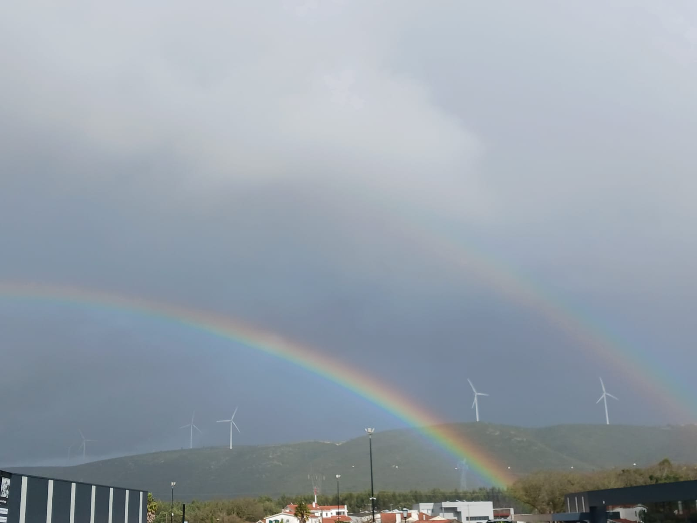

*“E Deus viu que isto era bom.”* Gn 1, 25

Nas últimas semanas, os encontros com o meu grupo de catequese do 6º ano têm tido como tema o Reino de Deus. Começando pelas parábolas que o ajudam a descrever e explicar, passando pelos milagres que o anunciam, e chegando às Bem-Aventuranças que nos mostram como se faz para o viver desde já. 

No final de um dos encontros, concluíamos que Deus nos ama muito e quer que sejamos felizes, e que o Reino de Deus é esse mundo bom, sem maldade nem injustiça, construído de acordo com as indicações de Deus. E, ao terminar, cada um ficava com o desafio de pensar, no concreto da sua vida, o que podia fazer para ajudar a construir o Reino de Deus. Só que, enquanto dizia tudo isto, percebi a dada altura que estava a falar um bocado ‘de cor’ e, num momento de uma certa descrença, perguntei a mim própria: “Mas acreditas mesmo nisto?” Porque acreditar em tudo isto, e que é possível pré-vivê-lo já neste mundo, pede um compromisso, uma atitude-conversão. Para mim às vezes ainda é difícil viver a fé em todas as dimensões da vida – como, de resto, acredito que ela é para ser vivida. O que vou dizer é cliché, mas é verdade: é fácil viver a fé dentro das quatro paredes da igreja (edifício); geralmente à segunda-feira de manhã é mais difícil continuar a ser Igreja. 
Vou percebendo que a expectativa e o compromisso com o Reino de Deus pedem uma dinâmica diferente de viver o dia-a-dia. A questão da coerência entre a fé e acções sempre foi clara para mim, mas, por exemplo, neste contexto o mundo do trabalho parece particularmente ‘armadilhado’: onde fica a caridade? E, no meio disto tudo, tenho pensado muito em algo que ouvi há muito tempo: “uma pessoa pode passar a vida inteira a fazer ‘coisas de Deus’ e, ainda assim, não ter feito o que Deus queria.” Até pelo meu feitio, tenho essa tendência de me pôr a fazer coisas, de dizer que sim porque posso, num certo activismo que nem sempre tem o coração dentro. E, ultimamente, tenho intuído que Deus me pede, num exercício de liberdade e responsabilidade, que discirna o que é mais conforme ao Seu plano para mim, e aprenda a decidir e a dizer ‘não’ quando for necessário. E acredito que, neste caminho surpreendente e pouco óbvio, O vou descobrindo mais e melhor. Voltando ao início: “O Reino de Deus não vem de maneira ostensiva. Ninguém poderá afirmar: ‘Ei-lo aqui’ ou ‘Ei-lo ali’, pois o Reino de Deus está entre vós.” (Lc 17, 20-21)

*“Porque el Reino en realidade está entre ustedes*

*Permanezcan en él.”*  
<a href="[url](https://youtu.be/wt6aTpFkCJs)">Anuncio del Reino - Missión País</a>

{:class="img-nosotros"}

